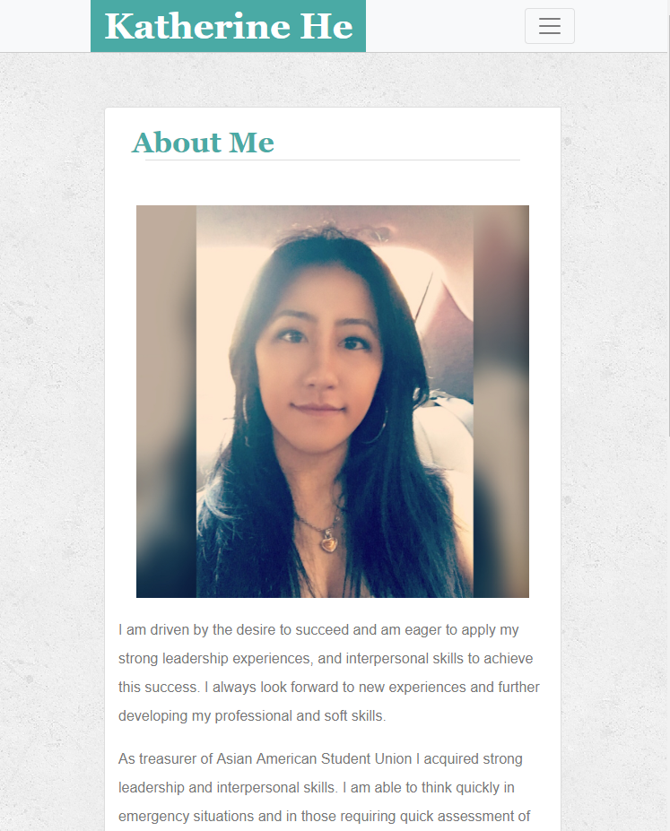
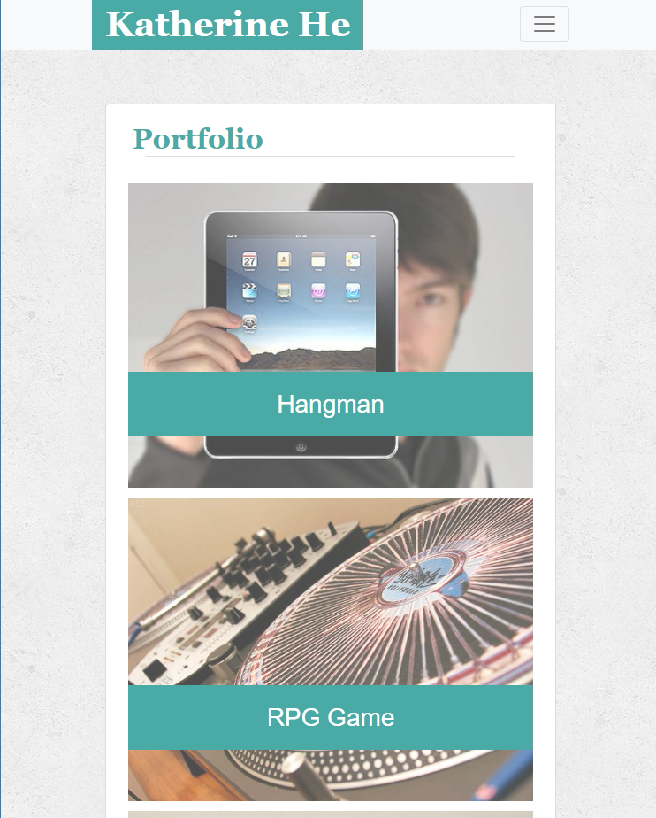
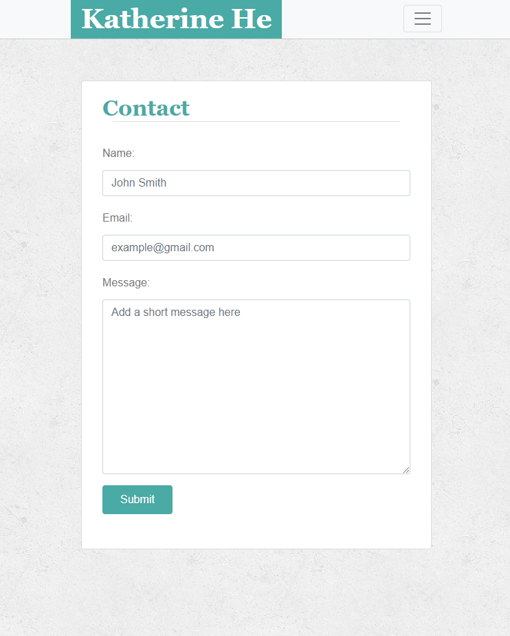

### Bootstrap-Portfolio

# _Responsiveness_Assignment_

The second assignment of Columbia Coding Bootcamp. 

# Finished Product: 

### Assignment One Instructions (Bootstrap)

1. Inside your `Bootstrap-Portfolio` repo, create `index.html`, `portfolio.html` and `contact.html`.

2. Using Bootstrap, recreate your portfolio site with the following items:

   * A navbar

   * A responsive layout (remember the grid, rows and columns are your friends)

     * eg. On `xs` and `sm` screens, each section should take up the entire grid. On `md` and larger screens, each section should take up 2/3 of the grid and the sidebar should take up 1/3 of the grid

   * Responsive images

   **BONUS**
   Using Bootstrap, make a sticky footer and use sub-rows and sub-columns on your portfolio site _(Hint: Check out the Bootstrap documentation)_

3. Your Bootstrap solution should minimize use of media queries.

4. Deploy your new Bootstrap-powered portfolio to GitHub Pages.